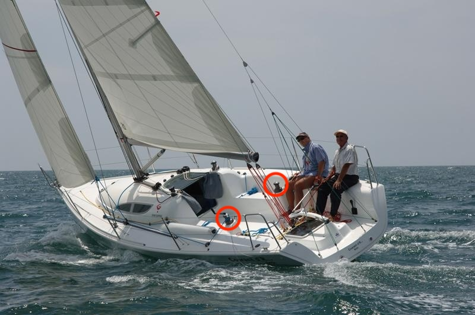
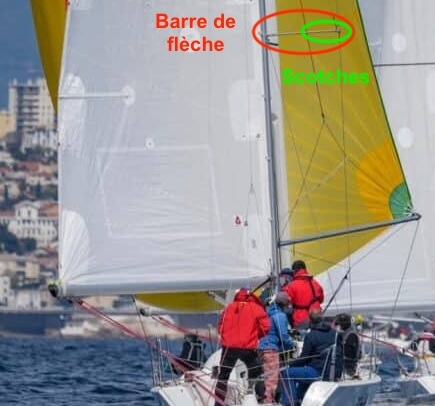
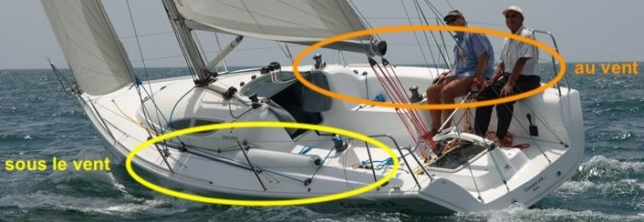
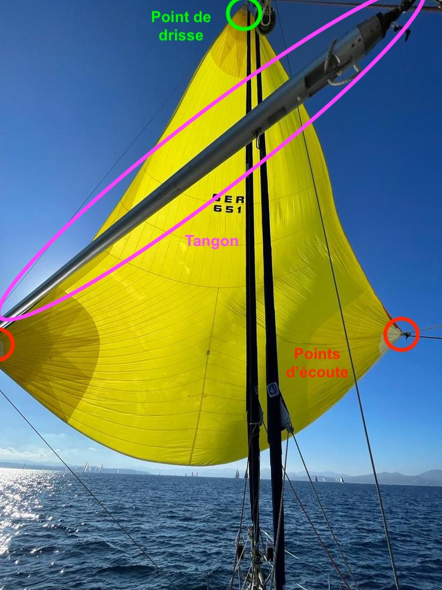

De manière générale, l'embraqueur est responsable du réglage des voiles d'avant, c'est-à-dire le génois et le spinnaker. Il agit donc sur les écoutes (de génois et de spinnaker), qui reviennent sur les winches latéraux pour le réglage.

# Les focs : le génois et le solent

En régate, on utilise le génois pour remonter au vent, et dans des conditions de vent fortes également pour redescendre jusqu'au largue[^1]. En cas de besoin, on pourra changer pour son cousin plus petit, le solent.

[^1]: on regardera la section "Allures" des _Fondamentaux_

Dans des conditions normales, on n'utilisera donc le génois que pour remonter au vent.

## Réglage

Comme pour toutes les voiles, on cherche à se placer dans la limite de faisseillement[^2] : il faut donc que le génois soit généralement plat, mais pas aplati. En remontant au vent, il y a deux indicateurs qui permettent d'observer cela :

- il faut que le génois soit intégralement dans la filière[^filière]
- il faut que la forme de la voile soit bien régulière, et donc qu'on n'ait pas l'impression qu'elle se gonfle à l'envers sur tout ou partie

[^2]: on regardera la section "Réglage de voile" des _Fondamentaux_
[^filière]: c'est le fil métallique qui longe le pourtour du bateau pour éviter que l'on ne tombe à l'eau

 

Il y a ensuite le réglage fin (qui est en fait la bonne manière de régler) :

- lorsqu'on règle pour du près, on borde jusqu'à atteindre un repère[^scotch] indiqué dans les barres de flèches : à mesure que le vent forcit, on borde davantage le génois :
    * en conditions de vent faible, on se mettra au premier scotch
    * en conditions modérées entre le deuxième et le troisième scotch
    * en conditions fortes, au quatrième, etc.
- pour toutes les autres allures, on cherche à maintenir les penons horizontaux. Comment savoir ce qu'il faut régler ?
    * lorsque le penon intérieur décroche, on borde la voile (dans la limite des scotches comme ci-dessus)
    * lorsque le penon extérieur décroche, on choque la voile

[^scotch]: c'est un morceau de scotch noir

## Virement de bord

Le rôle de l'embraqueur est le plus important lors du virement de bord : l'objectif est de restaurer le réglage du génois le plus rapidement possible de l'autre côté[^amure].

[^amure]: lorsqu'on vire de bord, la voile change de côté, et on dit qu'on a changé d'amure (bâbord amure = le vent vient de bâbord ; tribord amure = le vent vient de tribord). Le plus simple pour savoir de quelle amure on est, est de regarder la grand-voile : l'amure est le côté opposé à la grand-voile

Les embraqueurs formant un duo, le critère de réussite le plus important est leur synchronisation. Voici la chronologie de la manœuvre :

1. au signal du barreur ("Parés à virer"), l'embraqueur sous le vent[^au-sous-vent] descend et débloque l'écoute de génois du winch ; le réglage du génois ne change pas encore

 

2. le virement amorcé ("On vire"), l'embraqueur au vent se met en position, prêt à border
3. face au vent, l'embraqueur sous le vent choque le plus rapidement possible l'écoute ; de manière synchronisée, l'embraqueur au vent borde son écoute. Cette phase est la plus importante car elle permet de minimiser l'utilisation du winch. Bien exécutée, il n'y a presqu'aucun effort à fournir pour que le génois soit bordé pratiquement parfaitement et il ne restera plus qu'un tour ou deux de manivelle à faire
4. tout le monte remonte au rappel dès que possible
5. pour préparer le prochain virement de bord, le dernier embraqueur à remonter au rappel prépare 2-3 tours au winch (sans y bloquer l'écoute)

[^au-sous-vent]: on dit qu'on est au vent lorsque l'on est du côté d'où vient le vent, et sous le vent à l'inverse. Au près, on est au vent lorsqu'on est haut, et sous le vent lorsqu'on est bas (physiquement).

[**Le tutoriel de Team Winds**](https://www.youtube.com/watch?v=-t_bFcPbvMs&list=PLJJF-A9QVo4SfNCLggX2SoNek9IuOfy-0) permet d'illustrer ces étapes.

Quels sont les critères de réussite ?

- la synchronisation, il faut border avec vigueur très exactement lorsque l'autre embraqueur vient de choquer, ni avant, ni après
- le timing pour sortir du rappel : seul l'embraqueur sous le vent descend au signal ; tous les autres membres d'équipages ne font que sortir la tête de la filière et sont prêts à changer de côté
- le réglage en fin de manœuvre doit être restauré rapidement (même scotch) et normalement en quelques tours de manivelle seulement

# Le spinnaker

Contrairement aux focs, le spinnaker est une voile en toile légère : son réglage est dynamique, ce qui signifie qu'on ne règle pas le spinnaker à la manivelle de winch.

Il existe deux types de spinnaker :

- le spinnaker asymmétrique. Il ressemble grandement à un foc, à la différence qu'il n'est pas sur un étai[^etai] : il n'a donc qu'un point d'écoute, et le point le plus bas en avant se nomme le point d'amure. À chaque empannage, on retourne le spinnaker. On "tangonne" le point d'amure sur le bout dehors, qui est dans l'axe du bateau et au niveau du pont.

{ width=200 }

- le spinnaker symmétrique, qui nous intéresse ici. Il a une drisse[^drisse] et deux points d'écoute et doit conserver en permanence un angle constant par rapport au vent. En particulier, on ne le retourne pas lorsqu'on empanne. Le spinnaker symmétrique est tangonné et le tangon est accroché sur le mât, assez haut.

{ width=300 }

[^etai]: c'est un câble d'acier sur lequel on monte les focs
[^drisse]: c'est le nom générique des bouts qui permettent de monter les voiles en tête de mât

## Réglage de l'écoute

Comme toutes les voiles, il faut maintenir le spinnaker à la limite de faisseillement. Cependant, le faisseillement ne s'observe pas au même endroit : dans la partie visible depuis le cockpit, il faut qu'il y ait en permanence un petit repli[^larme] du spinnaker. Lorsqu'il apparaît, on borde légèrement. Lorsqu'il disparaît, il faut choquer.

Si, en choquant, on se rend compte que le pli n'apparaît pas, il ne faut pas hésiter à choquer davantage, et à communiquer à haute voix ses observations.

Inversement, si le spinnaker est bien réglé, mais tire trop fort dans les bras, il faut le signaler ("Pression"). De même, si on a l'impression de tirer dans le vide, que c'est trop mou, il faut le dire ("Pas de pression"). 

[^larme]: ce pli, ou faisseillement s'appelle une larme

## Réglage du bras

Dans le cas d'un spinnaker symmétrique, on a deux écoutes dont le rôle change en fonction de l'amure sur laquelle on est :

- l'une se comporte comme une écoute classique
- l'autre se comporte comme une amure qu'on peut régler ; on lui accroche le tangon dessus, c'est l'écoute au vent, qu'on appelle le bras

Au plus simple, il faut border le bras pour que le tangon soit dans l'axe de la bôme. En pratique, il faut que le tangon soit perpendiculaire au vent relatif.

## Envoi

Il y a trois phases pour envoyer le spinnaker :

1. on commence par prébrasser, c'est-à-dire envoyer l'écoute qui sert de bras au bout du tangon ("Brassé !"). Il faut ensuite bloquer le bras au winch.
2. on sort l'écoute qui doit être bordée au maximum pour sortir le spinnaker[^10]
3. après avoir abattu, on se trouve au vent arrière/grand largue et on drisse le spinnaker ("En tête !").

[^10]: idéalement, on bloque l'écoute de génois dans un taquet de stockage, tout en conservant le génois dans les filières pour mettre l'écoute de spinnaker au winch à la place

Une fois le spinnaker envoyé, on choque le spinnaker en grand pour le gonfler et le régler progressivement.

## Affalage sous le vent

L'objectif général de la manœuvre est de laisser reposer le tangon sur l'étai en débrassant. Il faut, pendant l'ensemble de la manœuvre, maintenir l'écoute dans un réglage à peu près constant pour ne pas mettre à l'eau les équipiers qui sont en train de ranger le spinnaker.

Comment savoir si l'on fait un affalage sous le vent ?

- on lance cet affalage tribord amure
- le tangon est donc à tribord
- on va ramener le spinnaker sous la bôme de grand-voile

On privilégie cet affalage lorsqu'il y a plus de vent car le spinnaker est alors masqué par le génois et la grand-voile.

## Affalage au vent

Cet affalage se fait sans tangon (et on fera un "tangon humain" le temps de l'affalage). Tant que le spinnaker n'est pas en train d'être ramené à bord, les embraqueurs doivent, le plus possible, faire en sorte de maintenir le spinnaker centré par rapport à l'axe du bateau.

## Empannage

Dès que le tangon est décroché, on fera en sorte de maintenir le spinnaker le plus centré possible. Cette manœuvre est délicate car il faut débloquer le bras du winch et traiter les deux écoutes de manière parfaitement symmétrique. En d'autres termes :

- si le spinnaker commence à s'en aller, il faut border assez généreusement
- si le spinnaker est trop proche de votre côté, il faut choquer

Si possible, il faut anticiper ce mouvement de balancier de sorte à le contrebalancer complètement et donc maintenir discrètement le spinnaker au centre. Dans ces conditions, les responsables de la voile d'avant vous remercieront ! Sinon, ils vont vous bouder un bout de temps…
