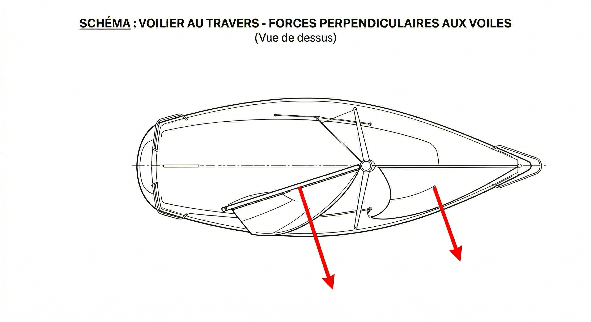
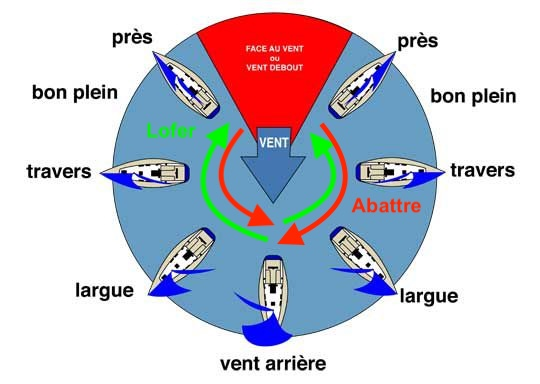
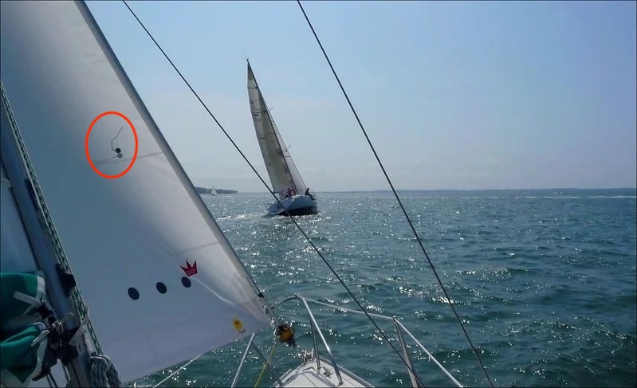

# Voiles

Sur les bateaux modernes, on a :

- une voile d'avant (génois et spinnaker)
- une voile d'arrière (grand-voile)

Elles sont situées respectivement en avant et en arrière du mât et donnent naturellement envie au bateau de tourner autour de son mât dans des directions opposées.

Concrètement, le mât est un axe de rotation autour duquel les voiles essayent d'entraîner le bateau dans un sens ou dans l'autre.

On le voit, pour que le bateau aille droit, il faut donc que les voiles soient réglées de manière équilibrée (entre la voile d'avant et d'arrière). C'est une condition nécessaire pour que le bateau soit sécurisé car manœuvrable et performant.

# Allures

On dit qu'on se rapproche ou qu'on lofe du vent lorsque l'angle entre la proue (l'avant du bateau) et le vent diminue, sinon on s'en écarte et on dit qu'on on abat.

Sur le dessin ci-dessus, le bateau est réglé correctement. On voit donc que :

- lorsqu'on lofe, il faut rapprocher les voiles de l'axe du bateau : on tire donc sur la corde (on dit que c'est un bout) de réglage de la voile. On dit qu'on borde l'écoute (de grand-voile, de génois ou de spinnaker)
- lorsqu'on abat, c'est l'inverse. On laisse donc le bout partir petit à petit, on dit qu'on choque l'écoute.

C'est une notion très importante ! Lorsque le barreur annonce qu'il lofe, il faut donc suivre au réglage, et border progressivement pour rester réglé. Inversement, s'il annonce qu'il abat, il faut choquer progressivement.

# Réglage de voile

Il faut comprendre que les voiles fonctionnent comme une aile souple :

- lorsque la voile est trop choquée, la toile est trop souple et bat ; on dit qu'elle fasseille
- lorsque la voile est trop bordée, la toile est trop raide et est parfaitement immobile

Dans l'idéal, il faut se situer en permanence entre les deux : la voile respire[^1]. On dit qu'on est à la limite de faisseillement.

[^1]: l'écoulement de l'air est laminaire, c'est-à-dire que les flux d'air glissent bien sur l'intérieur et l'extérieur de la voile. Si ce n'est pas le cas, la voile fonctionne plus ou moins comme un parachute et elle est moins efficace.

Comment savoir si la voile est bien réglée ?

1. On se place dans un premier temps en limite de faisseillement (approximativement). En d'autres termes si la voile est bien stable, on choque jusqu'à ce qu'elle soit en train de faisseiller ; si la voile bat, on borde jusqu'à ce que cela cesse
2. En limite de faisseillement, on essaye le plus possible de faire coller les petits fils (les penons) de part et d'autre de la voile à la voile. Lorsque le penon intérieur bat, on borde ; lorsque le penon extérieur bat, on choque.

 
