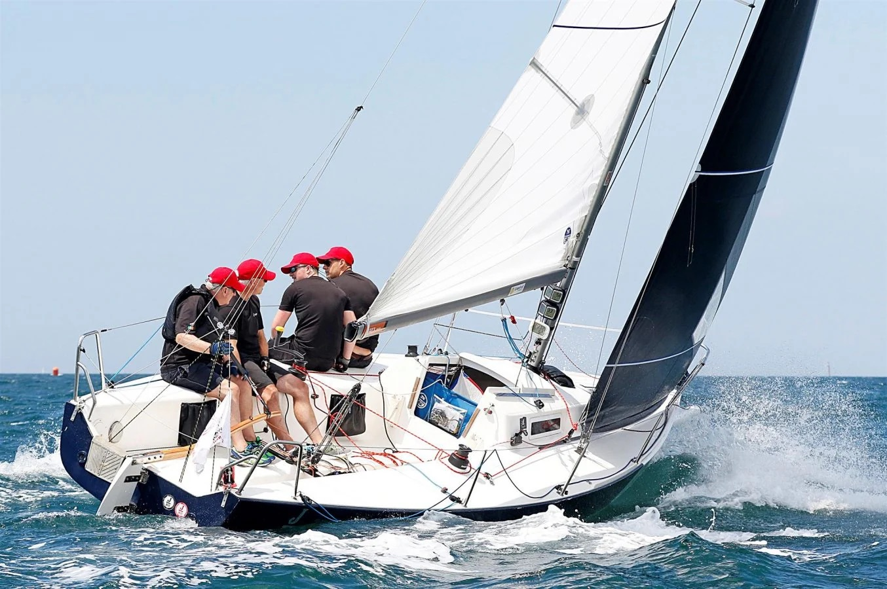
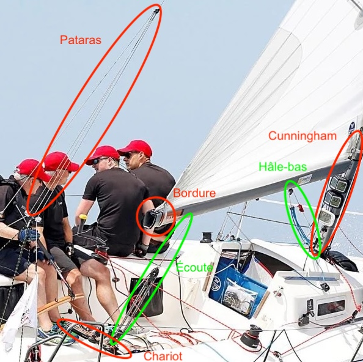

_Ce petit guide suppose une familiarité avec les sloops à gréement bermudien, et de manière générale le réglage des voiles._

# Habitable, dériveur... ?

L'habitable et le dériveur sont tous deux des monocoques, à la différence notable que le plan anti-dérive principal est fixe sur un habitable, et systématiquement lesté[^lest].

Une autre différence essentielle est qu'un habitable a un couple de redressement suffisant pour se remettre à la verticale quelque soit sa gîte. **On ne peut donc pas dessaler en habitable, au pire on fait un départ au tas et tout le monde s'accroche.**

[^lest]: cela signifie en particulier qu'on peut avoir un dériveur sur lequel on peut dormir, qui a une dérive lestée. La différence principale est que la dérive d'un dériveur est faite pour être relevée au cours de la navigation (à vos risques et périls), alors qu'un habitable à quille relevable n'est pas fait pour naviguer sous voiles avec la quille haute. Le [J70](https://en.wikipedia.org/wiki/J/70#Design) par exemple a une quille relevable, mais cela n'en reste pas moins un quillard…

# Réglages

Comme en voile légère, on commencera par régler les voiles d'avant avant de s'intéresser à la grand-voile. Pourquoi ? Lorsqu'on remonte au vent, on utilise de manière générale le génois, parfois le foc. En voile légère, le foc sert essentiellement à canaliser le flux d'air sur la grand-voile, en général intégralement lattée, et il y a une synergie. En habitable, on utilise davantage le génois, plus grand et à recouvrement, qui génère l'essentiel de la propulsion tout en jouant son rôle de canalisateur. Le réglage des voiles d'avant est **essentiel**, la grand-voile servant essentiellement à contrôler l'assiette du bateau.

Au portant, la situation est similaire hormis la synergie entre les voiles, qui est minime. On préfère d'ailleurs rouler le génois, maximiser la puissance du spinnaker, et encore et toujours contrôler l'assiette à l'aide de la grand-voile.

Comment savoir si l'on est bien réglé ? On commence par régler le génois en utilisant les penons (dans le doute, on choque ! Il faut évidemment communiquer avec le barreur afin de savoir à quelle allure on va), puis la grand-voile.\newline

La finesse du réglage dépend de l'état de la mer. En effet, plus la mer est formée, plus on cherchera à ouvrir la gamme de fonctionnement des voiles autour du réglage moyen. Cela permet de changer agressivement le cap au passage des vagues tout en gardant de la puissance en permanence, ce qu'un réglage plus fin ne permet pas de faire car la voile tolère moins bien les changements "d'allure". En d'autres termes, on introduit de la vrille à mesure que la mer se forme.

La vrille a deux effets : elle augmente la gamme d'angles auxquels la voile est efficace (une voile dont la chute est ouverte est plus efficace en bas lorsqu'on abat, et en haut lorsqu'on lofe), mais le compromis est de réduire la surface active de la voile à tout moment (une voile très vrillée, ne sera efficace que sur la partie basse, médiane ou haute par exemple). Introduire de la vrille, c'est donc chercher un équilibre.

## Réglage du génois

Les J80 de Deauville ont des repères (des morceaux de scotch dans les barres de flèche) qui sont utiles en fonction du vent pour indiquer quel est le réglage maximal (et idéal au près).

On pourra faire quelques observations pour optimiser le réglage sur l'ensemble de la voile : c'est l'intérêt du chariot de génois qu'on peut avancer ou reculer. Lorsqu'on l'avance, on tire verticalement sur la chute, ce qui a tendance à la fermer, et border sera plus efficace en haut de la voile[^exGénois].

{ height=15em }

[^exGénois]: Donc si les penons intrados du bas volent et que les penons extrados du haut volent également, il faut border en bas et choquer en haut, donc il faudra reculer le chariot

## Réglage du spinnaker

Comme sur toutes les voiles, on cherche à placer le spinnaker en limite de faisseillement, ce qui se matérialise par l'absence ou la présence intermittente d'une larme, c'est-à-dire un repli minime du bord d'attaque sur lui-même. Dans des conditions de vent faible à moyen, on pourra également choquer de l'amure afin de mieux descendre au vent (ce faisant, on échappe davantage au dévent de la grand-voile).

Le spinnaker est une voile légère qui nécessite une attention de tous les instants (elle doit être choquée quasi en permanence pour aller chercher la larme). Cela se traduit par un regard fixé sur le bord d'attaque.

En particulier, il est nécessaire d'informer le barreur des sensations dans l'écoute (_pression !_, _pas de pression !_). Réciproquement, le barreur informe le régleur des mouvements de barre qu'il exécute pour que le régleur puisse réagir avec le réglage approprié le plus rapidement possible.

## Réglage de la grand-voile

La grand-voile sert essentiellement en habitable à gérer l'assiette du bateau. Cela signifie en particulier qu'on peut accepter que la grand-voile faisseille légèrement, en particulier quand le génois renvoie (ceci étant dit, on y prêtera tout de même attention car c'est souvent le symptôme d'un mauvais réglage).

La variété des réglages de grand-voile est en général plus large qu'en voile légère car barreur et régleur de grand-voile sont deux postes distincts. On trouve donc l'écoute et le chariot, la bordure, le cunningham et le hâle-bas, ainsi que le pataras.

{ height=28em }

Ces réglages sont interconnectés pour la plupart, aussi il est utile d'observer les effets de chacun. Le chariot est le réglage le plus important : il règle l'angle de la bôme. L'écoute règle la proximité de la bôme au chariot, donc en particulier règle la tension de la chute, ou encore la hauteur de la bôme, ainsi que l'angle de la bôme. Cette subtilité est très importante pour comprendre comment ajuster la vrille de la grand-voile. En particulier, le hâle-bas ne doit servir qu'aux allures portantes jusqu'au travers, et ne sert plus dès le bon plein : l'écoute, avec sa démultiplication supérieure, est bien plus adaptée à ce rôle.

Le hâle-bas gère aux allures portantes l'angle de bôme avec le pont. On cherche en règle générale à maintenir la bôme horizontale.

Finalement, on agit sur la forme de la voile à l'aide du cunningham et de la bordure. Le cunningham tend le guindant, ou bord d'attaque, et avance le creux de la voile, rendant le bateau moins ardent. La bordure aplatit la voile et particulièrement le bas. Finalement le bord de fuite[^hypo] est réglé par l'écoute.

[^hypo]: c'est l'hypoténuse de la grand-voile !

À quoi sert donc le pataras ? Étant attaché au sommet du mât, il flambe le mât, c'est-à-dire qu'il le courbe vers l'arrière. La grand-voile, étant endrayée dans le mât, n'a donc d'autre choix que de suivre la courbe du mât, mais n'étant pas de la bonne forme (le guindant est droit), il faut nécessairement qu'elle se déforme pour combler l'écart. Il en résulte que le tissu au centre de la voile s'étire, réduisant significativement la profondeur de la voile, et a fortiori sa puissance.

C'est le réglage le plus efficace pour diminuer la puissance de la grand-voile, avant de toucher à l'écoute, au cunningham ou à la bordure.

## Interaction grand-voile/génois

L'eau ayant un fort pouvoir de ralentissement, bien au-delà de l'air, on cherchera en priorité à conserver le **bateau à plat** ainsi que minimiser le déséquilibre entre la grand-voile et le génois. En effet, un bon réglage équilibre la puissance des deux voiles et les couples résultants (contrairement au dériveur, on ne peut pas ajuster la dérive) s'annulent pour ne laisser qu'une force propulsive. Si les couples générés par la grand-voile et le génois ne s'annulent pas, la barre doit compenser afin de conserver une trajectoire rectiligne, et sert par là même d'hydrofrein. En règle générale, le bateau est ardent c'est-à-dire que lâcher la barre résulterait en une aulofée ; il s'agit là d'une sécurité par construction afin que le bateau se mette face au vent en l'absence de barreur. On accepte donc que le bateau soit un peu ardent, sans toutefois se faire arracher le bras.

## Réglage (très) fin

Finalement, le tant attendu nerf de chute : il y en a deux sur le bateau, un sur la chute du génois, et un sur la chute de la grand-voile. Il s'agit de deux fils qui courent le long de la bordure et permettre de tendre la bordure.

Le réglage optimal se situe à la limite des plis : il faut tendre au maximum la chute sans que des plis n'apparaissent. Ce réglage permet d'avoir une chute optimale, et correspond peu ou prou à une latte verticale[^blague].

[^blague]: dans des cas de désespoir avancés, on pourra relâcher ce nerf de chute pour ouvrir un peu davantage la chute (ne jamais faire ça, les nerfs sont placés à des endroits difficiles d'accès et trop régler les nerfs de chute, c'est s'exposer au danger)

# Postes à bord

En habitable, du fait des charges bien plus importantes sur l'ensemble des cordages qu'en voile légère, on sépare plus volontiers les tâches. D'avant en arrière, on a le numéro 1, responsable d'établir et d'affaler les voiles d'avant, le piano qui s'occupe de l'ensemble du gréement courant (drisses, amures, hâle-bas, etc.), les embraques ou régleurs des voile d'avant, la GV et le barreur.\newline

La grande différence entre la voile légère et l'habitable se situe dans l'utilisation de winches. À quoi sert un winch ? Tout d'abord, la friction est exponentielle en le nombre de tours de bout autour de la poupée, couramment appelée winch, cela permet donc de diminuer grandement la tension à exercer sur un bout en tension, et inversement, en faisant tourner la poupée, grâce à la friction, on peut augmenter la tension d'un bout déjà chargé (c'est typiquement le cas des écoutes de génois, souvent chargées de plusieurs tonnes). Bien utilisée, cette friction permet des désagréments tels que les doigts meurtris parce que saisis sous un bout. La technique la plus sécuritaire, quoique contrintuitive, est d'appliquer la main, si possible avec l'ensemble des doigts serrés, pouce compris, contre la poupée puis de sortir le bout de la gorge (que j'appelle personnellement goulotte faute d'avoir mieux appris). La friction étant exponentielle (c'est vraiment très important !), une pression assez faible suffira à retenir tous les bouts, sans exception. En règle générale, 3 tours suffisent.

Le second avantage du winch est son système de démultiplication. Sans entrer dans les détails, tourner à l'inverse du winch fait tourner le winch en grande vitesse, et tourner avec le winch augmente significativement la démultiplication. Un adulte, quelqu'il soit, peut actionner un winch quelle que soit la charge (c'est également pour cela que les winches doivent être manipulés avec attention pour ne pas dégrader le gréement !), à condition d'utiliser une position appropriée qui lui permet d'utiliser l'ensemble de la puissance de son corps.

Les winches sont généralement réservés au régleurs de voile d'avant et au piano, la grand-voile profitant de systèmes de poulies à la place.
