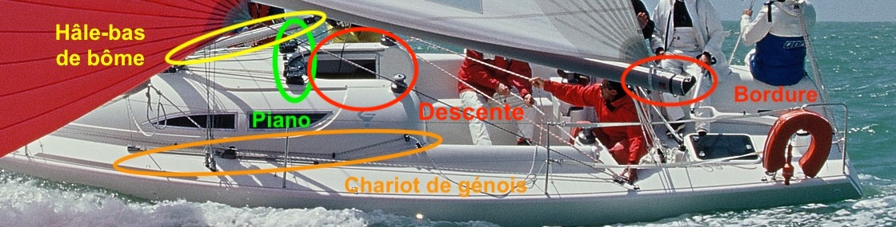

Situé au centre de l'équipage, le piano est un rôle qui demande une grande concentration :

- le pianiste est responsable de l'ensemble des drisses (notamment les voiles d'avant lors des envois et affalages)
- des réglages du gréement courant (cunningham, bordure, hâle-bas de grand-voile, chariots de génois, bosse de ris)
- gérer le tangon (balancine et hâle-bas de tangon)

Étant situé, pendant les manœuvres, dans la descente, il est également responsable de l'électronique à bord, notamment le déclenchement du chronomètre pendant les départs.

Pour maintenir un espace de travail propre et facile d'accès, on rangera au fur et à mesure les bouts du piano dans la descente.

# Grand-voile

## Envoi

Pendant la route vers la zone de départ, on enverra la grand-voile sous la supervision du pianiste. En particulier, il faut avoir le taquet de drisse de grand-voile fermé, et quelques tours au winch.

À son signal, le numéro 1 hisse la grand-voile à grandes brassées depuis le pied de mât et le pianiste ravale le bout en aval du winch. Pratiquement arrivé en tête de mât, la grand-voile devient dure à monter et on pourra faire l'arbalète :

- le numéro 1 ne tire plus vers le bas, mais horizontalement vers lui
- en relâchant, le piano ravale le mou

{ width=300 }

## Réglages fins

Les réglages fins de grand-voile permettent de changer la forme de la voile :

- cunningham : étarque la grand-voile et avance le creux ; le bord d'attaque s'étend vers le bas
- bordure : aplatit le bas de la voile, la voile devient plus plate de manière générale
- drisse de grand-voile : peu réglée en navigation, elle a l'effet opposé du cunningham (étarque la grand-voile vers le haut) mais remonte également la bôme
- hâle-bas de bôme : utilisée uniquement au portant, elle permet de rendre la voile plus plate et plus propulsive. Attention à relâcher le hâle-bas de bôme avant l'empannage pour qu'il soit plus doux, puis à le reprendre après l'empannage
- pataras (réglé par le régleur de grand-voile) : équivalent au palan de grand-voile en voile légère, il permet de tendre la chute (ou bord de fuite) et aplatir significativement la voile. En effet, son effet principal est de plier le mât vers l'arrière, or le mât peut difficilement se plier vers l'arrière (à cause des élingues) : il se plie donc vers l'avant et tire sur le milieu de la voile ! C'est notre réglage principal pour diminuer la puissance du bateau lors de la remontée au vent. **ATTENTION : il faut impérativement le relâcher avant d'envoyer le spinnaker car il y a un risque de démâtage**

# Génois

## Envoi

La procédure est sensiblement la même que pour la grand-voile, à la différence près qu'on peut envoyer le génois à toutes les allures sans trop de problème. On prendra garde à avoir les écoutes bien bordées ou bloquées.

## Réglage fin

Les réglages fins servent la même fonction sur le génois que sur la grand-voile, mais ils sont différents :

- chariots de génois : ils sont pris à proximité des haubans, et fonction des conditions de vent, avancés ou reculés (jamais plus de 10cm)
    * dans le petit temps, ou pour avoir plus de puissance pour passer le clapot, on avancera le chariot pour creuser la voile
    * à mesure que le vent monte, on reculera le chariot pour aplatir la voile
- le nerf de chute : augmente la tension de la chute (ou bord de fuite) permet globalement d'empêcher la chute de battre et améliore le rendement de la voile. On n'en prend qu'à la limite du battement
- le nerf de pied : idem

## Utilisation en rapport avec le spinnaker

Le génois sert, lorsqu'on se prépare à faire une manœuvre d'envoi ou d'affalage de spinnaker, à occulter le spinnaker, donc à lui enlever sa puissance et le manipuler facilement. Dans ces cas, on bordera systématiquement le génois à fond sur bâbord avant de hisser ou d'affaler, et ce pour hisser ou affaler le spinnaker aisément sur bâbord.

# Spinnaker

Certainement le cœur du travail du pianiste. En plus de coordonner les manœuvres d'envoi et d'affalage, toujours à l'écoute des numéros 1 et 2, il règle le grément courant pour le spinnaker (tangon et barbers haulers)

## Envoi

### Préparation

Pendant que le numéro 1 va accrocher le bras au tangon et clocher le tangon au mât (on se trouve alors au près), on l'aide à la balancine pour que le tangon soit léger, mais sans gêne. Une fois le tangon installé, une légère tension doit être mis sur balancine et hâle-bas (de tangon) pour le maintenir à l'horizontale.

Dans le même temps, on prébassera et il faudra donc aider au maximum le spinnaker à sortir du sac et de la chute pour qu'il se déchire pas.

### Drissage du spinnaker

Le pianiste ravale le mou de la drisse de spinnaker à mesure que le numéro 1 drisse le spinnaker. Pendant que le spinnaker sort, il faudra également l'aider à sortir de son sac et de la chute.

## Réglage du tangon

Il faut que le tangon soit généralement horizontal par rapport à l'eau, et perpendiculaire au vent (apparent). On pourra donc jouer sur la balancine et le hâle-bas.

Par ailleurs, en fonction des conditions de vent :

- plus il y a de vent, plus on monte le tangon (cela aplatit le spinnaker en haut et le fait perdre en puissance)
- lorsqu'il y a moins de vent, on descendra le tangon, quitte à le mettre sur les cloches plus basses.

Un point très important : il faut communiquer en permanence sur les réglages réalisés pour que le reste de l'équipage, et en particulier le régleur de bras, en ait conscience et puisse agir de concert.

Comment savoir si le tangon est bien réglé en hauteur ? On regarde le bord d'attaque du spinnaker (c'est-à-dire le côté au vent) :

- si la larme est proche du point de drisse, le tangon est trop bas
- si la larme est proche du tangon, le tangon est trop haut

Ces deux critères de proximité sont à prendre avec finesse : il faut prendre en compte la taille de la larme, et ne faire les réglages que lorsque l'embraqueur est effectivement en limite de fasseillement du spinnaker.

Un mnémotechnique : la larme est à hauteur constante par rapport au bateau, on fait bouger le spinnaker sous la larme via le tangon.

Finalement, vient la question de la proximité du pied de la voile à l'étai : pour cela, plus le tangon est brassé, donc reculé, plus il tire sur le spinnaker vers l'arrière. On débrassera un peu au besoin.

## Réglage des barbers haulers

Les barbers haulers, simplement appelés barbers, sont deux petites poulies par lesquelles les écoutes de spinnaker passent. Elles permettent essentiellement de régler la hauteur du point d'écoute pour qu'il soit à la hauteur du point de bras.

De manière générale, pour alléger les efforts sur le tangon, on prendra le barber au vent (sur le bras) au maximum. En pratique, ce réglage a peu d'influence, hormis en cas de vent fort où les efforts sont importants.

Le barber sous le vent reste un réglage dynamique : en cas de risée par exemple, on pourra le choquer pour laisser sortir de l'air.

## Particularités au largue

À mesure qu'on se rapproche du vent (on sort du vent arrière/grand largue pour aller au largue voire quasi travers), on sort du mode "parachute" du spinnaker pour entrer dans un mode davantage laminaire :

- on lâche du bras (pour maintenir le tangon perpendiculaire au vent apparent)
- on descend le tangon progressivement : cela raidit le bord d'attaque et le spinnaker symmétrique agit de plus en plus comme un asymmétrique. Précisément, le creux de la voile sera plus avancé et permettra d'avoir un bateau moins ardent
- toujours dans l'optique de rendre le bateau moints ardent, on veut diminuer le creux et donc la puissance du spinnaker : on relâche donc du barber (possiblement en grand). Dit autrement, cela recule le point de tire (on observera que la poulie recule, mécaniquement) et aplatit la voile (comme un chariot de génois).

ATTENTION : en cas de départ au lof (on parle aussi de départ au tas), il faudra dès que possible choquer du hâle-bas de **grand-voile**, voire en grand, permettant d'abattre de nouveau.

Pour davantages de subtilités sur le spinnaker et l'utilisation en coordination de l'ensemble des réglages à portée du pianiste, on se réfèrera à **[l'excellent article du Yacht Club de Fréjus](https://www.ycfrejus.fr/wp-content/uploads/2025/02/6-LE-REGLAGE-DES-VOILES-chapitre-6-Le-spi-symétrique.pdf)**.
