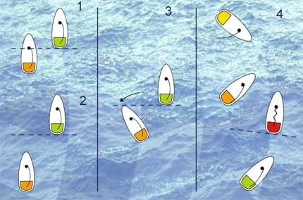

Un peu à l'image de la conduite sur route, voire de la F1, la régate est régie par des règles dont l'objectif est de garantir la sécurité à bord et ensuite l'équité entre les concurrents. Il y a généralement trois types de règles : les règles de sécurité, qui priment sur toutes les autres et s'inscrivent entres autres dans l'esprit et le sens marin, les règles de priorité, et les pénalités qui s'appliquent lorsqu'une règle des deux autres catégories ne sont pas respectées.

# Sécurité

Il faut éviter à tout prix les collisions, en plus encore les dégâts. Cela signifie en particulier qu'au quai, il y a des cris lorsque les bateaux ont touché, et des pleurs lorsqu'il y a de la casse. Dans le second cas, il n'y plus de bon droit (hormis devant l'assurance, et il faut se défendre car les bateaux coûtent cher ; il y a certainement une part plus ou moins grande de responsabilité chez l'une des parties, mais les dégâts sont presque toujours une responsabilité partagée et démontrer mutuellement les fautes de l'autre permet d'avoir indemnisation de part et d'autre) et les concurrents se retrouvent autour d'un verre s'ils le peuvent.

**Donc, éviter le contact. Il faut bien plus encore éviter la casse et les blessures.**\newline

En pratique, quelqu'un qui est "dans son bon droit" à cause d'une règle de priorité, mais qui ne fait pas preuve de courtoisie en prévenant d'une manœuvre qui peut engendrer du contact, est effectivement en tort ; **il faut laisser suffisamment de temps pour réagir au bateau qui subit la priorité**. Dans le doute, celui qui vient au contact de l'autre est généralement responsable du contact.

# Priorité

En guise de préface, il est très important de comprendre ce qu'est l'engagement : il s'agit du moment deux bateaux sur la même amure sont superposés en imaginant qu'on projette l'un sur l'axe médian de l'autre. Plus précisément, si n'importe quelle partie de l'autre bateau dépasse le tableau arrière de l'autre (c'est le plan perpendiculaire à l'axe du bateau passant par le point le plus à l'arrière du bateau), alors les bateaux sont engagés.

Sur l'image ci-dessus :

1. \textcolor{orange}{orange} dépasse le tableau arrière de \textcolor{green}{vert} (et réciproquement) : les bateaux sont engagés
2. \textcolor{orange}{orange} est loin derrière \textcolor{green}{vert} : il n'y a pas engagement
3. même si \textcolor{orange}{orange} et \textcolor{green}{vert} sont sur des allures différentes, la référence est le tableau arrière de \textcolor{green}{vert} ; l'engagement est sur le point d'être créé. On notera l'asymétrie de la situation : en prenant \textcolor{orange}{orange} comme référence, \textcolor{green}{vert} est clairement engagé (y compris si \textcolor{green}{vert} avançait). _En fait, on dira que \textcolor{green}{vert} est en route libre devant, et que \textcolor{orange}{orange} est en route libre derrière à condition qu'il n'y ait pas d'engagement dans un sens ou dans l'autre._
4. dans ce graphique, \textcolor{yellow}{jaune} \textcolor{orange}{orange} et \textcolor{red}{rouge} sont tous engagés deux à deux, en revanche \textcolor{green}{vert} n'est engagé avec persone... vraiment ? En fait \textcolor{green}{vert} est engagé avec exactement \textcolor{yellow}{jaune} (et personne d'autre) !

Petit mnémotechnique : l'engagement, c'est comme dépasser en voiture, sauf que la personne peut dépasser par la droite ou la gauche, et arriver d'en face...

## En route

_L'ensemble de ce paragraphe fait référence à une situation où l'on est à distance des marques de parcours, la situation est très différente lorsqu'on s'approche des marques._

Dans l'ordre :

- priorité à tribord amure
- priorité au bateau sous le vent (lorsqu'il y a engagement)
- priorité au bateau rattrapé (lorsqu'il n'y a pas d'engagement)

## Marques

Les marques (en général des bouées temporaires, mais sur des parcours côtiers, les marques peuvent également être des balises par exemple) sont considérées sous trois aspects différents :

- leur dimension physique (c'est une bouée qui fait $x$ mètres carrés, flotte et est portée par les vagues donc bouge). Toucher une marque induit une pénalité
- la distance qui sépare le bateau de la prochaine marque ; des règles particulières s'appliquent lorsqu'on se trouve à moins de **trois longueurs** (de coque du bateau le plus proche de la marque)
- une fois qu'on a dépassé la marque c'est-à-dire au premier moment où le tableau arrière a dépassé l'ensemble de la marque. On dit qu'on a **paré la marque**.

Tant qu'on est en dehors de **la zone des trois longueurs**, les règles usuelles de priorité s'appliquent. Dès lors qu'on est dans la zone des trois longueurs :

- le premier bateau à pénétrer dans la zone a priorité sur les futurs rattrapants, hormis...
- s'il y avait engagement entre un autre bateau et le premier bateau à pénétrer la zone, le bateau le plus à l'intérieur de la marque a priorité (en fonction de la direction par laquelle il faut parer la marque ; par exemple sur une marque à laisser à bâbord, le bateau le plus à bâbord a priorité, même s'il paraît assez évident à tout le monde qu'il ne peut pas parer la marque), quelque soit sa distance à la marque et le fait qu'il soit au vent ou non de ses concurrents. La position relative à la marque seule compte.

Que se passe-t-il si plusieurs bateaux sont engagés (comme une chaîne) et que le bateau le plus à l'avant est dans la zone ? Alors les règles de priorité autour de la marque s'appliquent, même si l'on est très loin (c'est particulièrement vrai dans des régates de haut niveau avec beaucoup de bateaux engagés au départ, où tout le monde se retrouve à la marque en même temps, et en général c'est le chaos...) !\newline

L'exception notable à la règle purement géométrique de la place à la marque est relative à la marque au vent : sur un parcours construit, on conserve la priorité due aux amures (donc tribord amure a priorité sur bâbord amure). En revanche, la place à la marque s'applique de manière implacable sur toutes les autres marques (côtier ou construit).

Une autre exception notable est que le comité (le bateau qui constitue la limite tribord de la ligne de départ) n'est pas une marque ! Plus précisément, on ne peut pas demander d'espace pour passer le comité.

# Pénalité

Lorsqu'un bateau enfreint une règle, il doit s'acquitter d'une pénalité[^officiel]. En règle générale, il s'agit d'un tour sur soi-même, réalisé le plus rapidement possible après l'infraction dans la mesure où cela ne met pas en danger les autres concurrents.

[^officiel]: dans les règles officielles, un bateau qui enfreint une règle est disqualifié, hormis s'il s'acquitte d'une pénalité comme prévu par les instructions de course

En théorie, les infractions doivent être observées par un jury et faire l'objet d'un "protest" en règle, c'est-à-dire sur l'eau héler "protest" en étant clair quant au bateau contre lequel on proteste tout en brandissant un fanion rouge. Le jury consigne alors la plainte (par exemple une marque touchée, un bateau au vent a abattu… à condition qu'effectivement le jury confirme que la plainte soit justifiée ; se plaindre afin de faire régner la terreur est également une infraction), et ne l'efface qu'à condition que le bateau fautif ait réparé (pour les dériveurs, la pénalité est souvent de deux tours[^pénalité]).

[^pénalité]: précisément, toucher une marque induit une pénalité d'un tour, et commettre une infraction contre un concurrent induit deux tours, hormis modification par les instructions de course

Une exception existe pour ne pas avoir à réparer malgré avoir commis une faute : si les bateaux en question ont commis une faute parce qu'ils ont été poussés à la faute par autrui, ils sont exonérés de la pénalité. Typiquement, un bateau qui abat sur un autre sur la ligne de départ et force, par sécurité, d'autres bateaux à abattre sous son vent, seul le bateau le plus au vent aura à réparer dans la mesure où tous les bateaux qui ont abattu ont protesté contre le bateau directement à leur vent.

Les pénalités se cumulent, hormis si elles sont commises pour accomplir une autre pénalité, etc.

Si une pénalité doit être réalisée par un concurrent qui vient de finir le parcours, pour l'accomplir il faut revenir sur le parcours (derrière la ligne d'arrivée).
